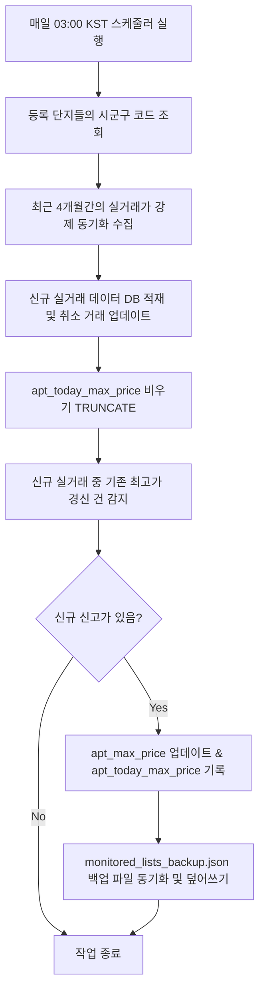

# AptTrade — 부동산 실거래가 수집 및 신고가 트래킹 시스템

국토교통부 공공데이터포털 API를 활용하여 15년치 부동산 실거래가(아파트 매매, 분양권 전매, 전월세)를 수집·적재하고, 모니터링 대상 단지의 최고가(신고가) 데이터를 실시간/데일리 배치로 갱신하여 관리하는 시스템입니다.

---

## 1. 운영 서버 및 데이터 현황 (2026-06-24 기준)

*   **실제 구동 서버**: `4g-server` (`168.107.28.232`) — Ubuntu
*   **배치 작동 계정 및 경로**: `ubuntu` 계정 / `/home/ubuntu/AptTrade`
*   **신고가 테이블 검증 결과**:
    *   `apt_max_price` (최고가 관리 테이블): **68,534건** 적재 완료
        *   `monitored_lists_backup.json` 백업 데이터를 PostgreSQL로 성공적으로 최초 마이그레이션하여 관리 중입니다.
    *   `apt_today_max_price` (오늘 신규 신고가 테이블): **0건**
        *   이 테이블은 매일 03:00 KST에 당일 발생한 신규 신고가 정보만 임시로 담은 뒤 비워지는 일회성 성격의 테이블입니다.
*   **전체 실거래 테이블 적재 행 수**:
    *   `apt_trade` (아파트 매매): **9,676,807 행**
    *   `silv_trade` (분양권 전매): **1,238,460 행**
    *   `apt_rent` (아파트 전월세): **11,147,034 행**

---

## 2. 파일 구조 및 핵심 기능

```
AptTrade/
├── db.py                # PostgreSQL 연결 관리 및 테이블 DDL (스키마 정의)
├── collector.py         # 공공데이터 API 호출, XML/JSON 파싱, 페이지네이션 처리
├── lawd_codes.py        # 전국 시군구 법정동 코드 (~250개) 딕셔너리
├── run_collect.py       # 15년치 부동산 실거래가 일괄/부분 수집 스크립트
├── scheduler.py         # 자동 수집 및 신고가 갱신 스케줄러 (매월/매일 작동)
├── sync_max_price.py    # JSON 백업 파일 ↔ DB 간 마이그레이션 및 신규 신고가 감지/갱신
├── monitored_lists_backup.json  # 모니터링 단지 및 최고가 정보 원본 백업 JSON
├── requirements.txt     # Python 의존성 라이브러리 목록
└── README.md            # 시스템 매뉴얼 및 가이드
```

### 각 파일별 주요 역할

1.  **`db.py`**
    *   PostgreSQL 커넥션 반환 (`get_conn()`)
    *   실거래가 및 신고가 테이블 생성 DDL 정의 및 초기화 (`init_db()`)
    *   `upsert_rows()`: 중복 등록 방지(`ON CONFLICT`) 및 취소 거래 정보 실시간 갱신
    *   `get_registered_lawd_codes()`: 대시보드 등록 단지의 법정동 코드만 추출하여 일일 업데이트 최적화에 기여
2.  **`collector.py`**
    *   국토부 실거래 API의 일별/월별 요청 생성 및 지수 백오프 기반 재시도(최대 5회)
    *   `numOfRows=1000` 설정 및 전체 행 개수(`totalCount`) 기반 자동 페이지 순회 페이지네이션
3.  **`run_collect.py`**
    *   15년치 대량 수집 메인 제어기 (멀티스레딩 `ThreadPoolExecutor` 적용)
    *   수집 완료 건은 `collect_log`에 기록하여, 중단 시 이어서 수집(Resume) 가능
4.  **`sync_max_price.py`**
    *   `--migrate`: JSON 데이터를 DB `apt_max_price`에 마이그레이션
    *   `--check`: 최근 1일 이내 수집된 실거래가 중 최고가 경신 건(신고가) 감지
    *   경신 건 발생 시 `apt_max_price`를 신규 정보로 업데이트(기존 정보는 `prev_*` 필드로 이동), `apt_today_max_price`에 기록 및 `monitored_lists_backup.json` 파일 실시간 동기화
5.  **`scheduler.py`**
    *   **월간 배치 (매월 5일 02:00 KST)**: 전월 전국 실거래 데이터 일괄 수집
    *   **일간 배치 (매일 03:00 KST)**: 등록단지 기준 최근 4개월간 실거래가 강제 동기화(취소거래 및 신규 데이터 반영) 및 신고가 경신 검사(`sync_max_price.py --check`) 자동 수행

---

## 3. 데이터베이스 테이블 구조

### `apt_max_price` (최고가 관리 테이블)
모니터링 대상 아파트 단지의 역대 최고 거래 내역을 저장하며, 신규 실거래 갱신 시 업데이트됩니다.

| 컬럼명 | 타입 | 설명 |
| :--- | :--- | :--- |
| `id` | BIGSERIAL (PK) | 자동 증가 일련번호 |
| `monitored_id` | BIGINT (UNIQUE) | JSON 원본의 고유 ID |
| `sido` / `sigungu` / `dong` | TEXT | 지역 정보 (시도, 시군구, 법정동) |
| `sigungu_code` | CHAR(5) | 5자리 법정동 시군구 코드 (INDEX) |
| `apt_name` | TEXT | 아파트 명칭 |
| `area` | TEXT | 전용면적 (평형대 구분용, 예: "59") |
| `jibun_addr` | TEXT | 지번 주소 |
| `build_year` | TEXT | 건축년도 |
| `prev_max_price` | BIGINT | 직전 최고가 (만원 단위) |
| `prev_max_date` | VARCHAR(10) | 직전 최고가 거래일 (YYYY-MM-DD) |
| `prev_max_floor` | VARCHAR(10) | 직전 최고가 층 |
| `prev_max_dong` | VARCHAR(50) | 직전 최고가 동 |
| `last_max_price` | BIGINT | 최신 최고가 (만원 단위) |
| `max_price_date` | VARCHAR(10) | 최신 최고가 거래일 (YYYY-MM-DD) |
| `max_price_floor` | VARCHAR(10) | 최신 최고가 층 |
| `max_price_dong` | VARCHAR(50) | 최신 최고가 동 |
| `last_update` | TIMESTAMPTZ | 최고가 정보 최종 갱신 일시 |

### `apt_today_max_price` (오늘 신규 신고가 발생 내역)
당일 발생한 최고가 경신 거래 내역을 별도로 보관하는 테이블입니다.

| 컬럼명 | 타입 | 설명 |
| :--- | :--- | :--- |
| `id` | BIGSERIAL (PK) | 자동 증가 일련번호 |
| `monitored_id` | BIGINT | 대상 아파트 ID |
| `sido` / `sigungu` / `dong` | TEXT | 지역 정보 |
| `sigungu_code` | CHAR(5) | 시군구 코드 |
| `apt_name` | TEXT | 아파트 명칭 |
| `area` | TEXT | 전용면적 |
| `jibun_addr` | TEXT | 지번 주소 |
| `deal_amount` | BIGINT | 경신한 거래금액 (만원 단위) |
| `deal_date` | VARCHAR(10) | 거래일 (YYYY-MM-DD) |
| `floor` / `dong_nm` | VARCHAR | 거래 층 및 동 정보 |
| `prev_max_price` | BIGINT | 직전 최고가 |

---

## 4. 수집 및 신고가 동기화 흐름 (Flow)



---

## 5. 주요 운영 명령어 가이드

### 1) 수집 상태 및 통계 확인
*   **전체 현황 점검**:
    ```bash
    python check_status.py
    ```
*   **상세 에러 내역 포함 점검**:
    ```bash
    python check_status.py --detail
    ```

### 2) 수동 수집 및 동기화 테스트 (서버 내 실행)
*   **수동으로 신규 신고가 체크 및 JSON 파일 동기화**:
    ```bash
    python sync_max_price.py --check --file monitored_lists_backup.json
    ```
*   **JSON 데이터를 DB로 강제 최초 마이그레이션**:
    ```bash
    python sync_max_price.py --migrate --file monitored_lists_backup.json
    ```
*   **특정 기간 및 유형 수동 수집**:
    ```bash
    # 2026년 5월 ~ 6월 아파트 매매 실거래가만 수집
    python run_collect.py --from 202605 --to 202606 --type apt_trade
    ```
